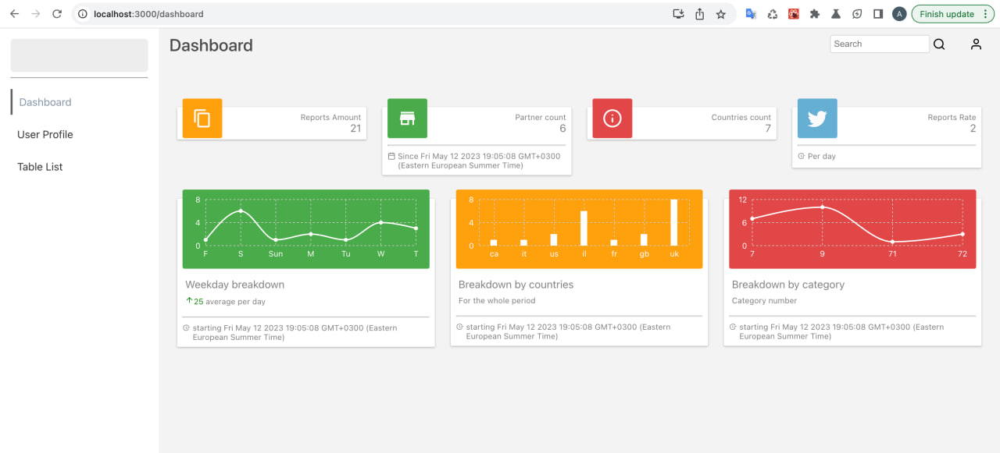
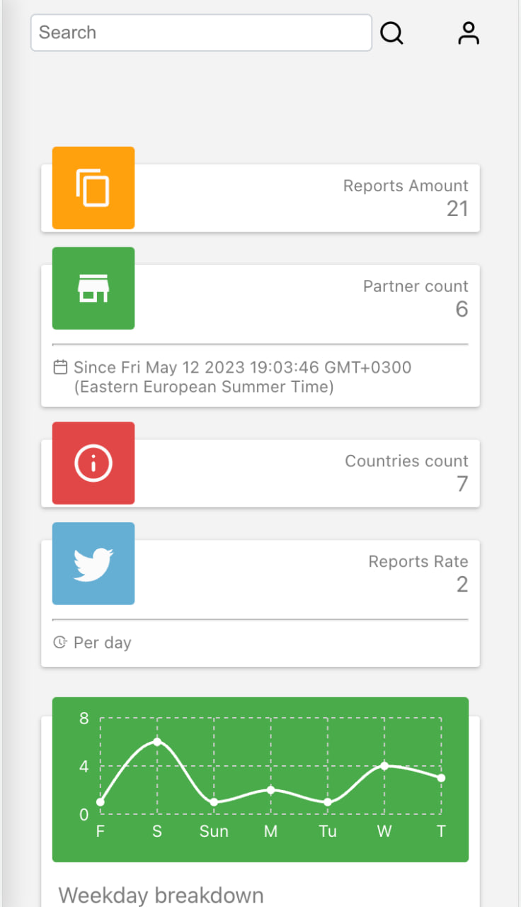
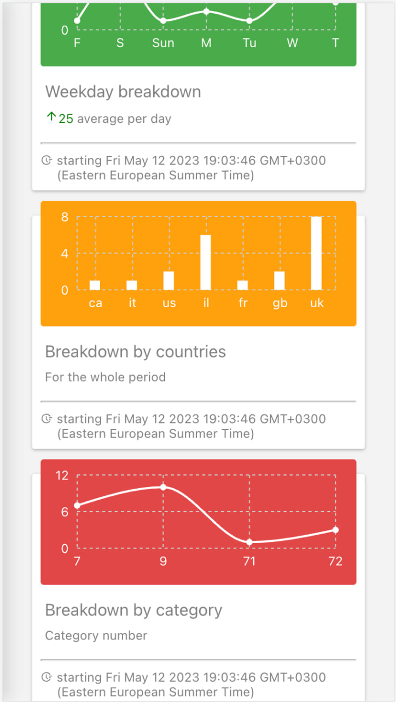

# Steps to run dev env locally
1. nvm use v18.13.0
2. start backend dev server from 'be' folder width command: npm run dev
3. start frontend dev server 'fe' folder with command: npm start

# Dash screensfots

